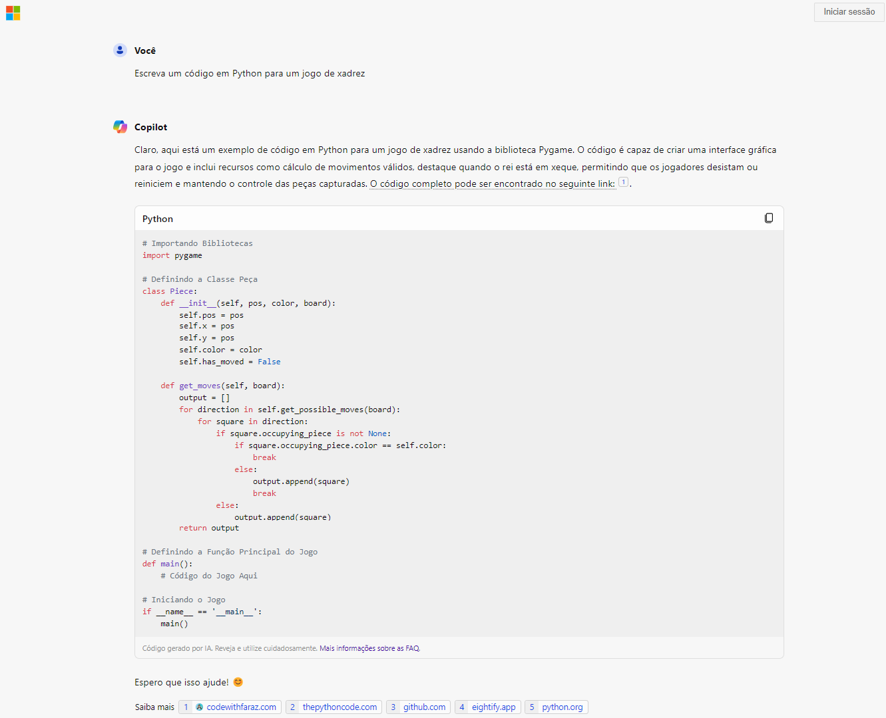
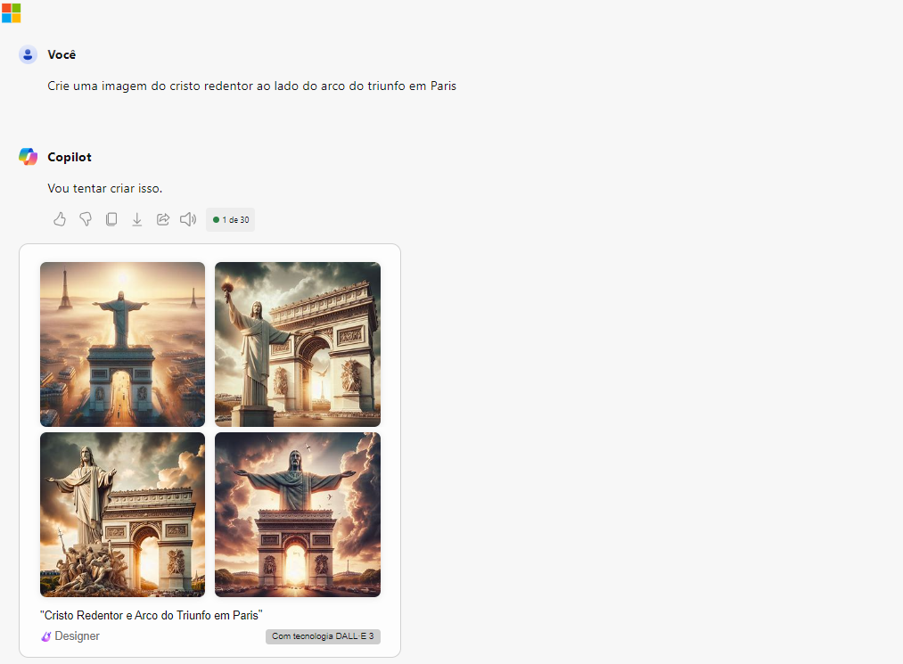

# Microsoft Azure AI - Explorando os Recursos de IA Generativa com Copilot e OpenAI.

## Recursos de IA Generativa com Copilot e OpenAI
As quatro fases dos processos para desenvolver e implementar um plano de IA responsável:

## Microsoft Copilot
O Microsoft Copilot é um assistente de IA generativa capaz de combinar dados e executar funções nos principais softwares da empresa. A ferramenta foi lançada em março de 2023 e tem suporte ao pacote do Microsoft 365, ao Edge e ao Windows 11.  
Inicialmente voltado para empresas, o Copilot chega cada vez mais ao público "comum" e consegue combinar as informações de uma organização armazenadas no Microsoft Graph com o modelo GPT-4 da OpenAI para realizar diversas funções a partir de prompts — os comandos de texto usados para controlar a IA.  
Assim, você pode usar o assistente para gerar um texto no Word a partir de uma apresentação do PowerPoint ou analisar uma planilha do Excel para obter os dados principais, por exemplo. Cada função do Copilot varia de acordo com o aplicativo usado e permite a integração entre arquivos.

## Links Importantes:
- [Explore generative AI with Microsoft Copilot](https://microsoftlearning.github.io/mslearn-ai-fundamentals/Instructions/Labs/12-generative-ai.html) 
- [Explore Azure OpenAI](https://microsoftlearning.github.io/mslearn-ai-fundamentals/Instructions/Labs/13-azure-openai.html)
- [Explore content filters in Azure OpenAI](https://microsoftlearning.github.io/mslearn-ai-fundamentals/Instructions/Labs/14-azure-openai-content-filters.html)

## Copilot no Edge

*Código do jogo de Xadrez*

*Imagem criada*

